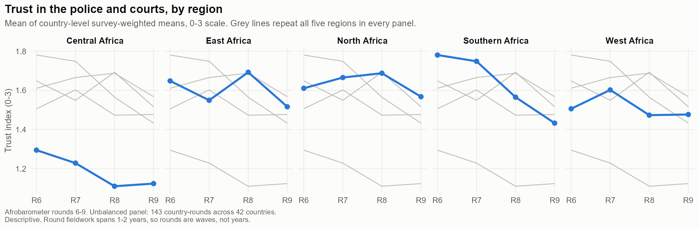
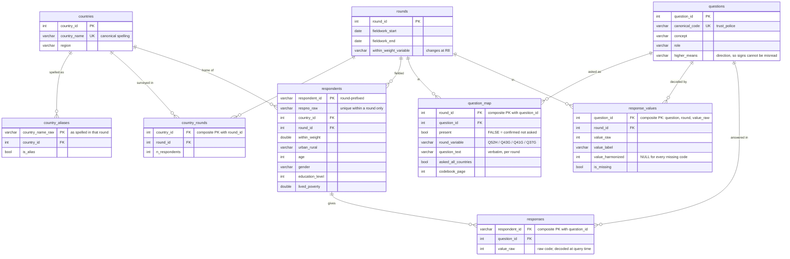

# Trust in African institutions: a normalized survey database and descriptive panel

A relational database built from four merged Afrobarometer survey rounds, and a
descriptive analysis of what moves with trust in the police and the courts.

**[Read the two-page memo →](docs/memo.md)**



---

## Summary

Across Afrobarometer rounds 6–9 — **201,286 respondents in 42 African countries,
fielded 2014–2023** — this project harmonizes four survey waves whose question
codes, response scales, missing-value conventions, survey weights and even
country names change between rounds, and assembles them into a normalized DuckDB
database. Survey-weighted country-round means are built in SQL; inference runs in
R. Within countries and net of round effects, **perceived government economic
performance co-moves strongly with trust in enforcement institutions**
(0.342 points on a 0–3 scale, ≈ half a within-country standard deviation,
bootstrap *p* = 0.001), while **perceived corruption is not distinguishable from
zero** (−0.224, *p* = 0.081–0.144 across three inference layers). Both results
hold on the balanced panel of 31 countries present in all four rounds. **The
analysis is descriptive; it does not identify a causal effect.**

## Data source, citation and usage policy

Afrobarometer data are copyright-protected and are **not redistributed in this
repository**. Afrobarometer requires that published work using its data
acknowledge the source by bibliographic citation, in this format:

> Afrobarometer Data, 42 countries, Rounds 6–9, 2014–2023, available at
> http://www.afrobarometer.org.

Afrobarometer also asks that copies of publications using the data be sent to its
head of publications. See the [data usage and access policy](https://www.afrobarometer.org/data/data-usage-and-access-policy/).

This repository's **code** is MIT-licensed (see `LICENSE`). That licence covers
the code only and relicenses nothing belonging to Afrobarometer.

## How to obtain the raw data

The `.sav` files and codebook PDFs are not in this repository. Download them from
Afrobarometer's [merged data page](https://www.afrobarometer.org/data/merged-data/)
and place them in `data/raw/`:

```
data/raw/Merge6.sav   data/raw/Merge6_Codebook.pdf
data/raw/Merge7.sav   data/raw/Merge7_Codebook.pdf
data/raw/Merge8.sav   data/raw/Merge8_Codebook.pdf
data/raw/Merge9.sav   data/raw/Merge9_Codebook.pdf
```

Everything else in the pipeline is rebuilt from these eight files.

## How to reproduce

Requires R (≥ 4.2) with `haven`, `pdftools`, `dplyr`, `tidyr`, `purrr`, `readr`,
`stringr`, `stringi`, `tibble`, `DBI`, `duckdb`, `survey`, `fixest`,
`clubSandwich` and `ggplot2`. No DuckDB CLI is needed — the database is built
through the R bindings. **Run every command from the repository root.**

```bash
Rscript R/01_inventory_sav.R        # .sav metadata  -> docs/inventory_*.csv
Rscript R/02_parse_codebooks.R      # codebook PDFs  -> docs/codebook_entries.csv
Rscript R/03_build_crosswalk.R      # the crosswalk  -> docs/crosswalk_*.csv
Rscript R/04_convert_sav.R          # .sav           -> data/staging/*.parquet
Rscript R/05_build_database.R --fresh   # runs sql/01-05 + the analysis views
Rscript R/06_analysis.R             # models         -> output/*.csv
Rscript R/07_figures.R              # figures        -> figures/*.png
```

Each script checks its own preconditions and stops with an actionable message
rather than failing downstream. `R/05_build_database.R` treats validation as a
**gate**: if any check in `sql/05_validate.sql` fails, the build stops rather
than handing you a database that looks finished. A clean run reports
`All validation checks passed`, four rounds reconciling to their published row
counts, and `36/34/34/39` countries.

### Repository layout

```
sql/  01_schema  02_load_staging  03_build_crosswalk  04_normalize  05_validate
      analysis/  panel_country_round  change_over_rounds
                 rank_within_region   coverage_report
R/    00_utils  01_inventory_sav  02_parse_codebooks  03_build_crosswalk
      04_convert_sav  05_build_database  06_analysis  07_figures
docs/ question.md (the frozen estimand)  crosswalk_*.csv  memo.md
      phase1_inventory_findings.md
```

## Schema



**`question_map` is the heart of it.** One concept, four round-specific codes.
`response_values` handles the harder half: codes shifting is easy, *scales and
missing-value conventions* shifting is what breaks naive merges.

## Design notes

**Why long format, and what it costs.** `responses` is one row per respondent ×
question — about 2.07 million rows — rather than a wide table. Long format is
slower for analysis and requires a join to make any value interpretable. It was
chosen because the alternative hard-codes round-specific variable names into the
load step, which is precisely the problem this project exists to solve. The
aggregation happens once, in `sql/analysis/`, and the cost is paid there rather
than in every downstream query.

**The unpivot is driven by data, not by column names.** `04_normalize.sql` melts
each staging table with `UNPIVOT` over `COLUMNS(*)` and joins the result to
`question_map`. No round-specific variable name appears anywhere in the SQL: add
a concept to the crosswalk, re-run, and the file does not change. (An earlier
version used `to_json`, which is tidier but requires DuckDB's `json` extension —
that turned a fresh-clone rebuild into something needing network access, so it
was removed. The build now uses no extensions at all.)

**Harmonization decisions, and the one that is a judgement.** Response scales
turned out to be stable across all four rounds — trust and corruption 0–3,
performance 1–4 — so no collapsing was needed. What did change:

| What changed | Rounds | How it is handled |
|---|---|---|
| Variable codes | every round | `question_map`, one row per concept × round |
| "Refused" code | `98` in R6, `8` in R7–9 | per-round `response_values` |
| Corruption referent | "government officials" → "civil servants" at R8 | treated as one concept; **stated as a measurement caveat** |
| Within-country weight | `withinwt` → `withinwt_ea` at R8 | EA version used throughout, the definition continuous across the break |
| Urban/rural categories | 3 or 4 categories, varying | collapsed to binary |
| Country names | Swaziland → Eswatini (2018) | `country_aliases` |

Only the corruption referent is a genuine judgement call. Restricting to rounds
6–7 would remove it at the cost of half the panel; the memo argues for
harmonizing and saying so, and reports it in the limitations.

## Data-quality findings

Every item below was found while building, and each is a reason the database is
shaped the way it is.

- **`RESPNO` collides across rounds — and within one.** 201,286 rows carry only
  66,429 distinct `RESPNO` values; `BEN0001` appears in all four rounds. Hence
  round-prefixed keys. More surprisingly, `RESPNO` is *not* unique within R8
  either: 24 values are duplicated across 48 Sudanese respondents who differ in
  region, interview date, age and weight — genuinely different people sharing an
  ID. They are disambiguated deterministically rather than dropped.
- **`Merge6.sav` declares LATIN1 and holds non-UTF-8 bytes.** Row 39,619 has a
  Portuguese verbatim in `Q29B`. A default `read_sav()` of the whole file fails —
  but `n_max = 1` and `col_select` reads both succeed, so this surfaces only in
  the full staging conversion. All reads go through `read_sav_safe()`.
- **`9` means different things in different items.** On the education item
  `9 = Post-graduate` is a valid answer; on every trust, corruption and
  performance item `9 = Don't know`. Missingness is a property of the item, not
  the code — which is what `response_values` exists to record, and what a
  schema `CHECK` constraint now enforces.
- **Coverage is unbalanced.** 25 of 168 possible country-rounds are empty; 31 of
  42 countries appear in all four rounds; six appear once and drop out of any
  within-country comparison, leaving **36 effective clusters**.
- **One item-level gap reaches the estimates.** The economic-performance question
  was not asked in Sudan in R6. Three independent sources agree — zero valid
  responses in the data, code `99 = Not asked in this country` on 1,200
  respondents, and the R6 codebook note. It removes that cell from every model.
- **Undocumented codes.** `URBRUR = 460` (Peri-Urban) appears in R6 and R7 data
  but is documented only in the R7 codebook; 88 and 40 cases respectively.
- **Item non-response is trending.** "Don't know" on the corruption item falls
  from 9.70% in R6 to 6.08% in R9. The estimation sample composition therefore
  shifts across rounds.
- **Afrobarometer's own region assignment moves.** Madagascar and Mauritius are
  Southern Africa in R6–R7 and East Africa in R9. The most recent assignment is
  used throughout so countries do not appear to migrate mid-panel.

## Limitations

**This analysis is descriptive. Two-way fixed effects on observational
cross-country survey data does not identify a causal effect.** Trust, perceived
corruption and perceived performance plausibly all respond to the same
unobserved shocks, and reverse causation is live.

The sharpest threat is **common-method bias**: outcome and covariates come from
the same respondent in the same interview, so a single response tendency moves
all three together. Nothing in this design separates that from a substantive
relationship. Rounds are **waves, not years** — R6 fieldwork ran March 2014 to
November 2015, R8 ran July 2019 to July 2021 — so round fixed effects absorb
wave, not calendar time. With **36 country clusters**, conventional
cluster-robust standard errors are optimistic; CR2 Satterthwaite degrees of
freedom come out at 13–18, and every estimate is reported under three inference
layers for that reason.

`docs/memo.md` §5 sets these out in full, and `docs/question.md` records the
estimand that was frozen before any estimation.

---

*Code: MIT. Data: Afrobarometer, not redistributed and not relicensed.*
