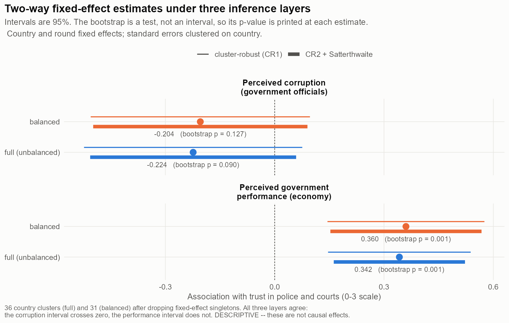
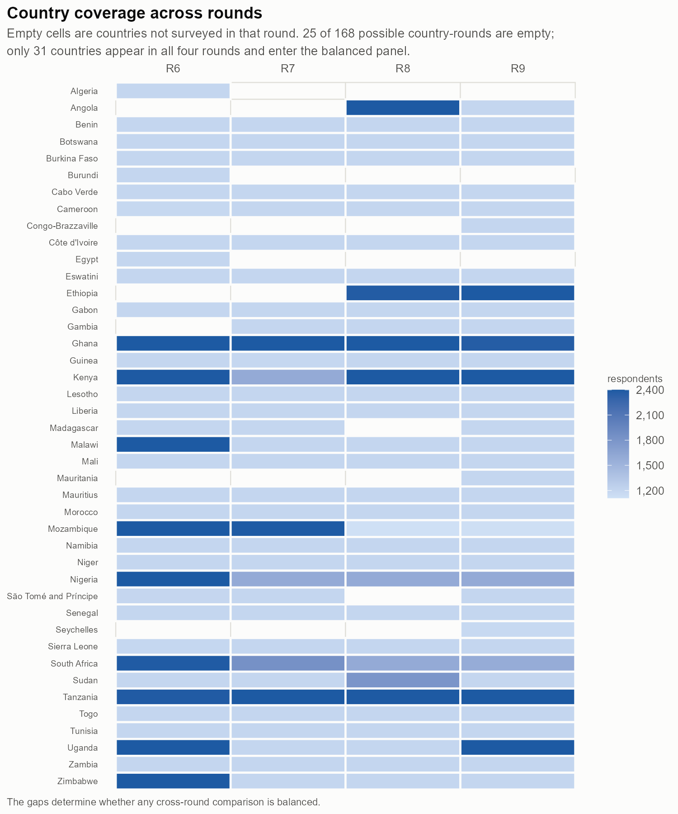

# Trust in the police and courts across Africa, 2014–2023

**What moves with it, and what does not**

Afrobarometer rounds 6–9 · 42 countries · 201,286 respondents
Reproduction: [repository README](../README.md) · Data: Afrobarometer merged rounds 6–9

> **This analysis is descriptive.** Two-way fixed effects on observational
> cross-country survey data does not identify a causal effect. Nothing below is
> an estimate of what would happen to institutional trust if perceived
> corruption or economic performance were changed.

---

## 1. Question

Trust in the institutions that enforce law — the police and the courts — is
what makes voluntary compliance with the state possible, and it is the outcome
family underlying a large literature on state capacity in Africa. Two accounts
compete for what sustains it: a **fiscal-exchange** account, in which citizens
extend trust when they believe the state delivers, and a **capture** account, in
which trust erodes when they believe officials are corrupt. Both are measurable
in Afrobarometer, and both are asked consistently enough across rounds 6–9 to be
compared over nearly a decade. This memo asks which of the two moves with trust, within
countries, across four survey waves.

## 2. Data and construction

The analysis pools four merged Afrobarometer rounds — **201,286 respondents in
42 countries**, fielded March 2014 to July 2023 — into a normalized relational
database, from which a country-round panel of **143 cells** is built in SQL.

The central construction problem is that the same question is not the same
variable twice. Trust in the police is `Q52H` in Round 6, `Q43G` in Round 7,
`Q41G` in Round 8 and `Q37G` in Round 9; the gender and education items are
renumbered in Round 9; and the within-country survey weight changes definition
at Round 8, when Afrobarometer splits it into enumeration-area and household
versions. Rather than assume alignment, every concept is mapped to its
round-specific code in an explicit **crosswalk** — 17 concepts × 4 rounds, with
every response code and its harmonized value recorded and traceable to a
codebook page. Two decisions are load-bearing:

- **Missing codes are a property of the item, not the code.** Round 6 codes
  "Refused" as `98` where later rounds use `8`; and on the education item
  `9 = Post-graduate` is a *valid* answer while `98`/`99` are missing. A
  round-invariant or code-invariant missing rule would silently delete the
  most-educated respondents. All missing codes map to NULL, never to a value.
- **The referent of the corruption item shifts.** Rounds 6–7 ask about
  "government officials"; rounds 8–9 ask about "civil servants". These are
  treated as one concept, and that is a judgement, recorded as a measurement
  caveat rather than smoothed away.

The weight used throughout is the enumeration-area version, the definition
continuous across the Round 7/8 break. Country names also drift — Swaziland
became Eswatini in 2018 — and are resolved through an alias table, because a
name-based join would otherwise split one country into two.

## 3. Method

The outcome is a **trust-in-enforcement index**: the mean of trust in the police
and trust in the courts, each on Afrobarometer's 0–3 scale, computed only where
both are answered. Country-round means are survey-weighted; standard errors are
clustered on country. The panel model includes **country and round fixed
effects**, so the comparison is within country, across rounds, and time-invariant
country characteristics are absorbed. Because the panel has only **36 country
clusters** after dropping countries observed in a single round, conventional
cluster-robust standard errors are optimistic — the CR2 Satterthwaite degrees of
freedom come out at 13–18, not the naive 41 — so every estimate is reported
under three inference layers: conventional cluster-robust, CR2 with Satterthwaite
degrees of freedom, and a wild cluster bootstrap with the null imposed. Results
are shown for the full unbalanced panel and for the 31 countries present in all
four rounds.

## 4. Findings

### 4.1 Trust in enforcement institutions fell after Round 7

The survey-weighted mean index across all respondents is **1.586** in Round 6,
**1.609** in Round 7, **1.529** in Round 8 and **1.450** in Round 9 (0–3 scale).
The decline is not uniform: Southern Africa falls furthest, from 1.78 to 1.43,
while North and West Africa are close to flat and Central Africa is lowest
throughout.

*Figure 1 and the regional figures average countries, so each counts once;
the four round figures above pool respondents, so large samples count for more.
The two differ in the second decimal — 1.595 against 1.586 in Round 6.*

### 4.2 Perceived economic performance co-moves with trust; perceived corruption does not

Within countries and net of round effects, a one-point-higher country-round mean
on perceived government handling of the economy is associated with a
**0.342-point-higher** trust index (bootstrap *p* = 0.001). Scaled to the
variation the model actually uses, a one-within-country-standard-deviation rise
in perceived performance corresponds to roughly **half a within-country standard
deviation** of trust.

Perceived corruption goes in the expected direction but is **not distinguishable
from zero**: −0.224, with *p* between 0.081 and 0.144 depending on the inference
layer. Restricting to the balanced panel moves neither conclusion (+0.360 and
−0.204).

The two covariates behave differently over time in a way consistent with this.
Perceived economic performance falls steadily across the four rounds (2.21 →
1.88) alongside trust, while perceived corruption is essentially flat (1.44 →
1.43). Multiplying the fitted association by the observed fall in perceived
performance gives about −0.11 index points against an observed fall of −0.15.
That is arithmetic on an association, not a decomposition: it says the two move
together at a comparable scale, not that one produced the other.

### 4.3 The panel is unbalanced, and one gap reaches the estimates

Of **168 possible country-rounds, 25 are empty** — countries enter and leave the
survey. Only 31 of 42 countries appear in all four rounds. Six appear once and
contribute nothing to a within-country comparison. One item-level gap propagates
directly into the estimates: the economic-performance question was not asked in
Sudan in Round 6, which removes that cell from every model.

## 5. Limitations

**This is descriptive, and the design cannot be pushed further.** Trust,
perceived corruption and perceived performance plausibly all respond to the same
unobserved shocks, and reverse causation is entirely live — someone who trusts
the police may rate the government more favourably for that reason. There is no
exogenous variation here, no instrument and no discontinuity.

**Common-method bias is the sharpest threat.** Outcome and covariates come from
the same respondent in the same interview. A respondent in a bad mood, or one
answering to please the enumerator, moves all three together. This alone could
generate the Section 4.2 association, and nothing in this design separates it
from a substantive relationship.

**Rounds are waves, not years.** Round 6 fieldwork ran March 2014 to November
2015; Round 8 ran July 2019 to July 2021. Two countries in the same round can be
eighteen months apart, and Round 8 straddles the onset of COVID-19. Round fixed
effects absorb wave, not calendar time.

**Item non-response is itself trending.** "Don't know" on the corruption item
falls from 9.70% of respondents in Round 6 to 6.08% in Round 9, and on the
performance item from 6.55% to 2.30%. Dropping those respondents means the
estimation sample composition shifts across rounds in a way that is itself
correlated with the covariates.

**Instrument drift is documented but not eliminated.** The corruption referent
changes from "government officials" to "civil servants" between rounds 7 and 8.
If respondents read the second as narrower, part of the flat corruption series
is measurement rather than stability — which would bear directly on the null in
Section 4.2.

**Coverage is unbalanced**, and the composition of countries changes underneath
any raw cross-round average. The balanced-panel results are reported for this
reason and agree with the full panel.

## 6. What would strengthen this

The honest next step is not more rounds but **exogenous variation**. Three
routes, in ascending order of credibility: use the staggered timing of
anti-corruption agency creation or major corruption prosecutions as a
difference-in-differences design; exploit sub-national variation in service
delivery against Afrobarometer's within-country regions, which this database
retains but this analysis does not use; or link to an administrative shock —
a natural-resource price movement, a documented fiscal transfer — that moves
perceived performance without plausibly moving trust through another channel.
Separating common-method bias from substance would need a split-sample or
list-experiment design that Afrobarometer does not currently support.

---

*Data: Afrobarometer merged rounds 6–9, obtained from afrobarometer.org and not
redistributed. Every figure and number above is generated by script from a
rebuildable database; see the repository README to reproduce.*
